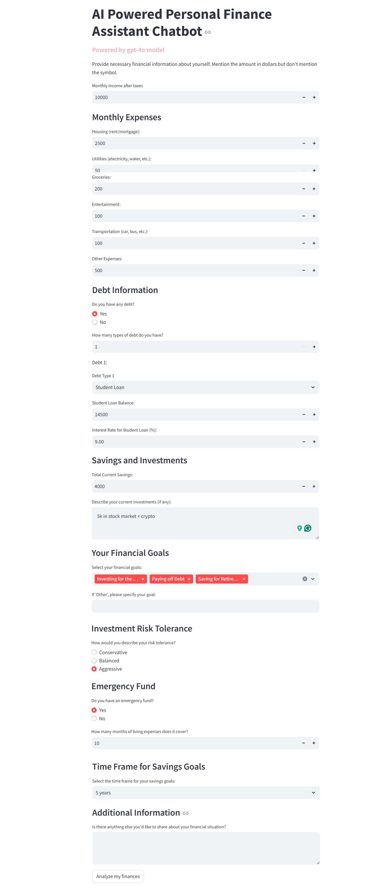
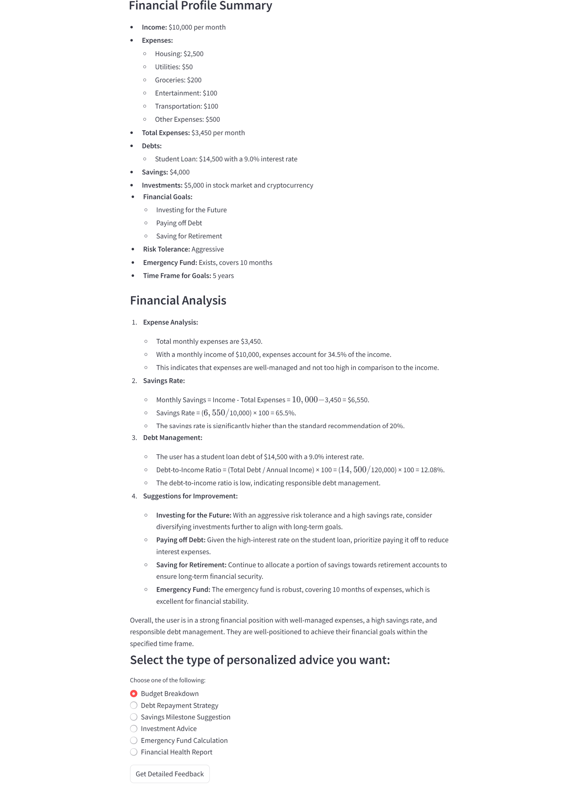
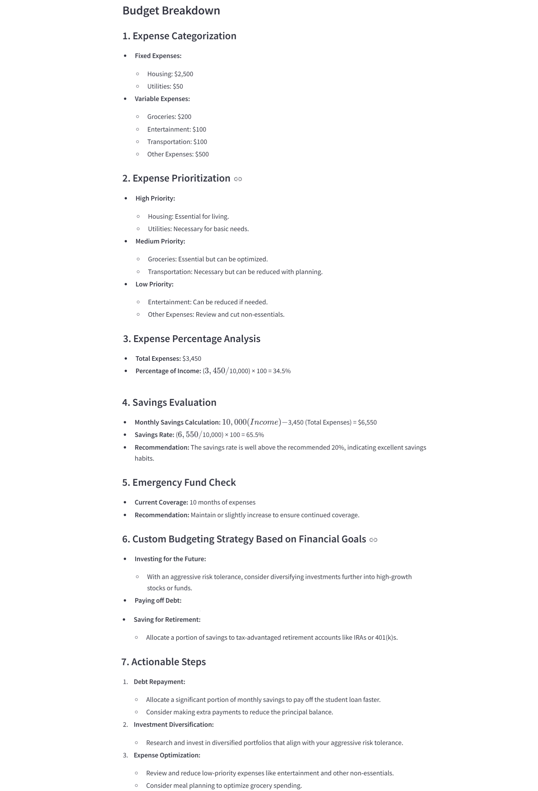
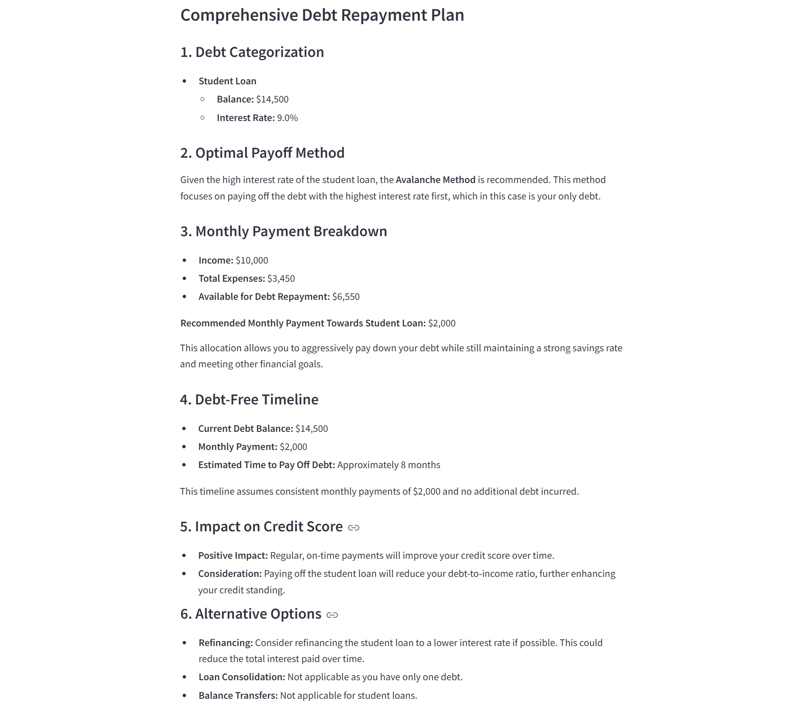
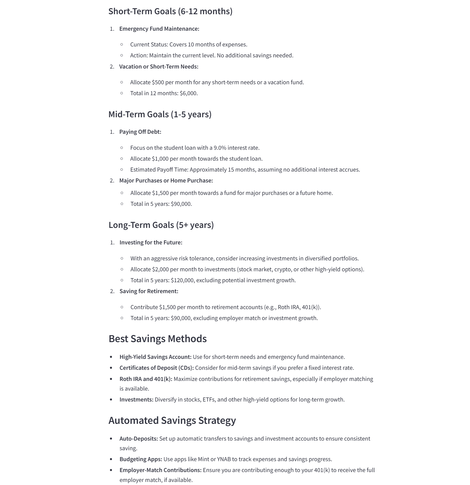
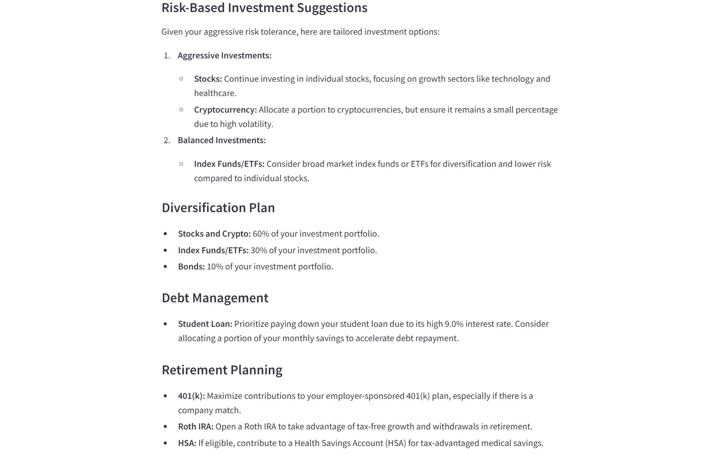
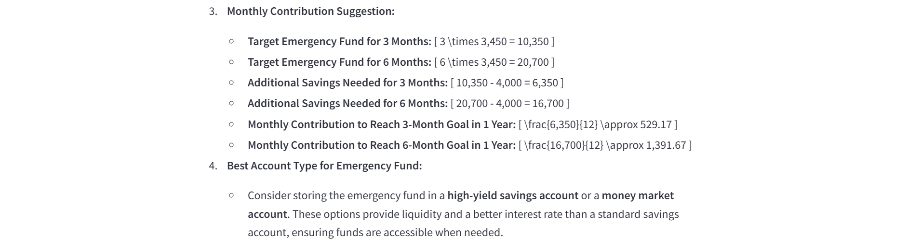
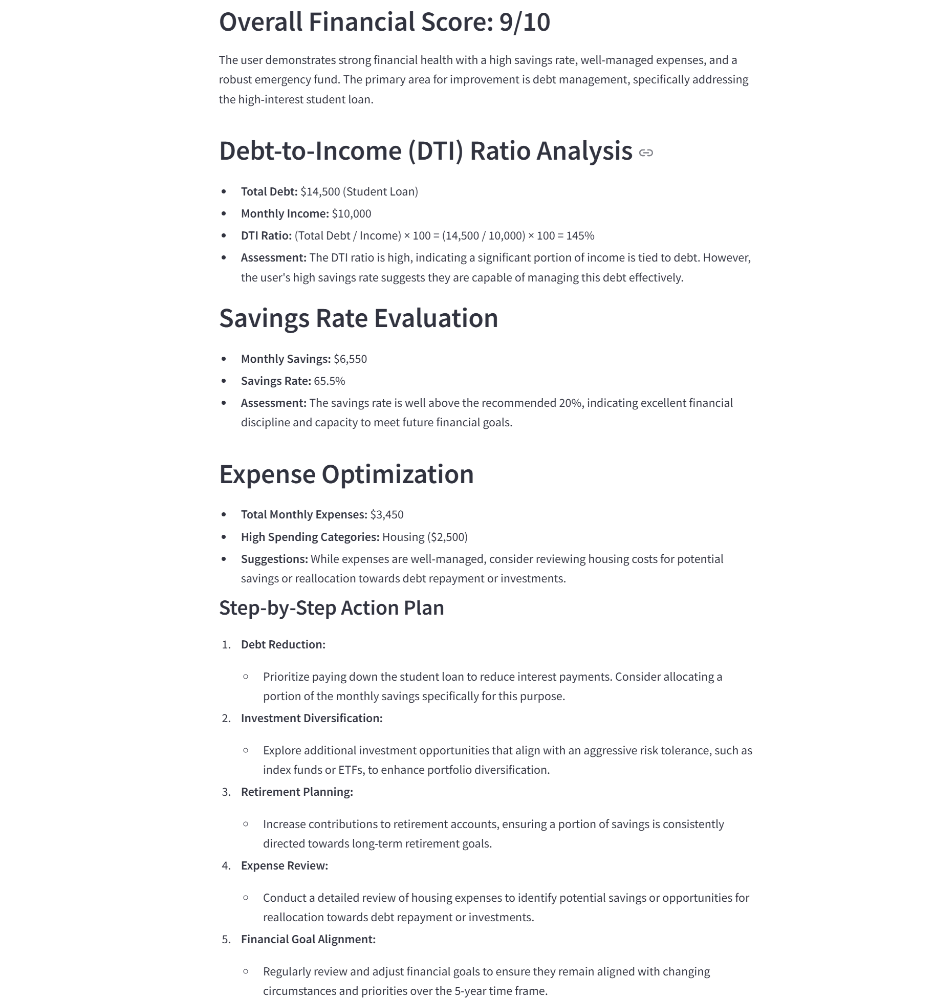

🚀 AI-powered chatbot to analyze personal finances, suggest budgeting strategies, and provide investment recommendations. Built with **Streamlit** and **LangChain**. 

## 📌 Features
✅ **Analyze your income, expenses, and savings**  
✅ **Budget Breakdown**  
✅ **Debt Repayment Strategy (Avalanche vs. Snowball method)**  
✅ **Savings Milestone Suggestions**  
✅ **Investment Advice based on risk tolerance**  
✅ **Emergency Fund Calculation**  
✅ **Financial Health Score & Step-by-Step Recommendations** 

## 🖥️ Demo (Screenshots) - Responses were generated live by AI model based on my inputs
### **1️⃣ Main Interface**

### **2️⃣ Results of "Analyze My Finances" by gpt-4o model**   

### **3️⃣ Budget Breakdown Analysis**

### **4️⃣ Debt Repayment Strategy Analysis**

### **5️⃣ Savings Milestone Analysis**

### **6️⃣ Investment Advice Analysis**

### **7️⃣ Emergency Fund Calculation Analysis**

### **8️⃣ Financial Health Report Analysis**

## 🛠️ Installation & Setup

**1️⃣ Clone the Repository**
* git clone https://github.com/yashagrawal5757/Gen-AI/tree/main/Personal%20Finance%20Assistant%20Chatbot
* cd Personal-Finance-Chatbot

**2️⃣ Install Dependencies**
* pip install -r requirements.txt

**3️⃣ Set Up API Keys**  

Create a file named .env and add:

* OPENAI_API_KEY=your-openai-api-key
* LANGCHAIN_API_KEY=your-langchain-api-key

**4️⃣ Run the Chatbot**  
    streamlit run main.py

## ⚙️ How It Works
1️⃣ Enter your financial details (income, expenses, savings, goals, risk tolerance).   
2️⃣ Click "Analyze my finances" to get an AI-generated report.   
3️⃣ Choose an advice category (Budget, Debt, Savings, Investment, Emergency Fund, or Financial Health).   
4️⃣ Get personalized detailed recommendations and action insights based on your financial data.   

## 🛠️ Technologies Used
* Python 🐍
* Streamlit 🎨
* LangChain 🤖
* OpenAI GPT-4o 🧠

## 📝 License
This project is open-source and available under the MIT License.

## ⭐ Contribute & Support
* If you found this project useful, give it a ⭐ on GitHub!
* If you have ideas or found bugs, open an issue or submit a pull request.